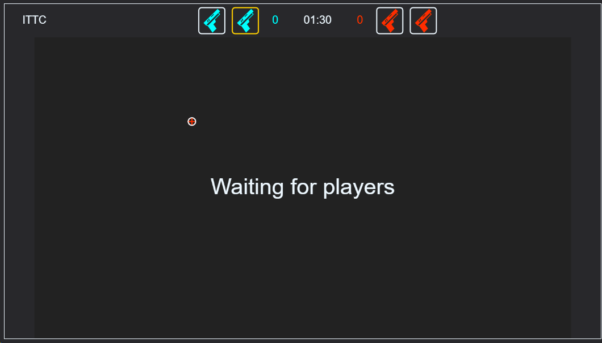
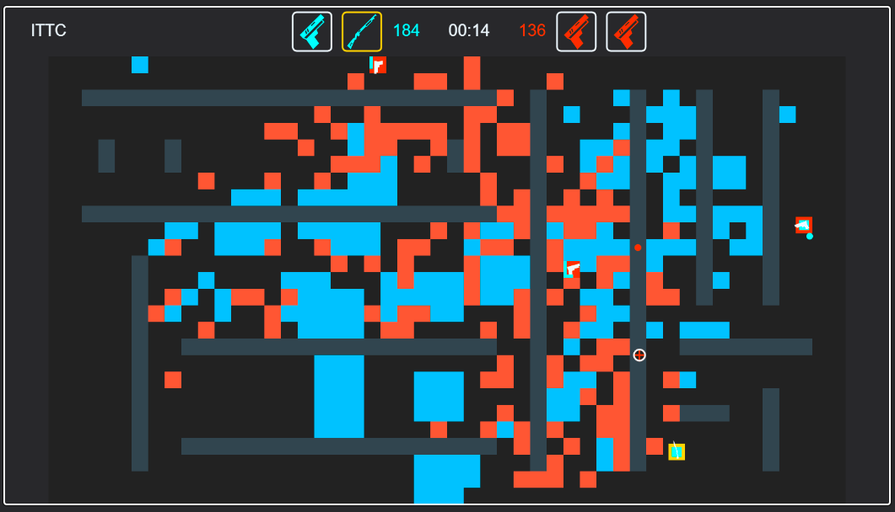

# Untitled Online Game

A real-time multiplayer browser game. Go server over WebSockets, TypeScript/Canvas client, no game engine — just a tight render loop and a custom binary protocol.

- **Server:** Go (Fiber + WebSockets)
- **Client:** TypeScript + Vite, plain Canvas rendering (`client/`)




## Prerequisites

- Go 1.25 (see `go.mod`)
- Node.js or Bun, for the client
- [`air`](https://github.com/cosmtrek/air) if you want auto-reload on the server during dev (optional)

## Running it locally

Easiest way, if you have `air` and `bun`:

```bash
make dev
```

This spins up the Go server with hot reload and the Vite dev server together.

If you'd rather run things by hand, or don't use Bun:

```bash
# server
go run .

# client, in another terminal
cd client
npm install
npm run dev
```

The client runs on `http://localhost:5173`, and the server listens on port `3000` and handles WebSocket connections at `/ws`.

## Building for production

```bash
make build
```

This builds the client, then compiles the server with `go build -o build/game .`. The server embeds the built client assets (from `public/`) directly into the binary via `embed`, so the result is a single executable.

```bash
./build/game
```

That's it — no separate static file server needed.

## Project layout

- `client/src/` — frontend entry point and game loop
- `msgs/` — binary message definitions, shared logic between server and client
- `entities/` — server-side game state and player logic
- `weapons/`, `types/`, `consts/` — gameplay rules and tuning values (tick rates, etc. live in `consts/consts.go`)

## Notes

- All client/server communication is a custom binary protocol — no JSON, to keep things fast and compact. If you're debugging, the Network → WS tab in your browser's dev tools will show you the raw frames.
- The `Makefile` calls `bun run dev` for the client by default. Swap that for `npm run dev` (or `pnpm`) if that's what you're using.
- Server logs go to stdout, so just run it from a terminal to see what's happening.

## Contributing

Issues and PRs welcome. If you're touching the message formats, try to keep changes backward-compatible — see `msgs/`.